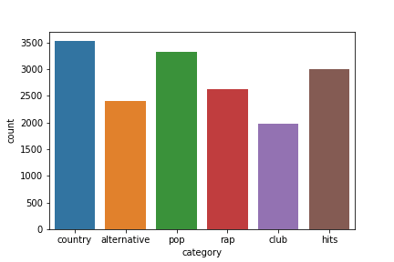
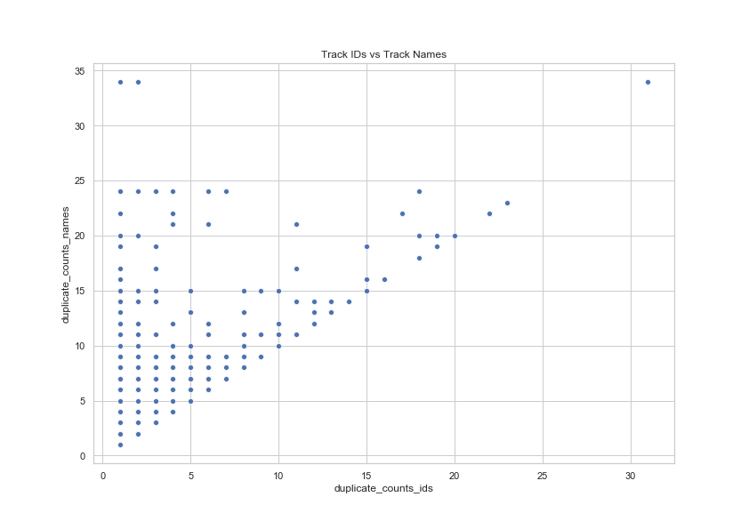
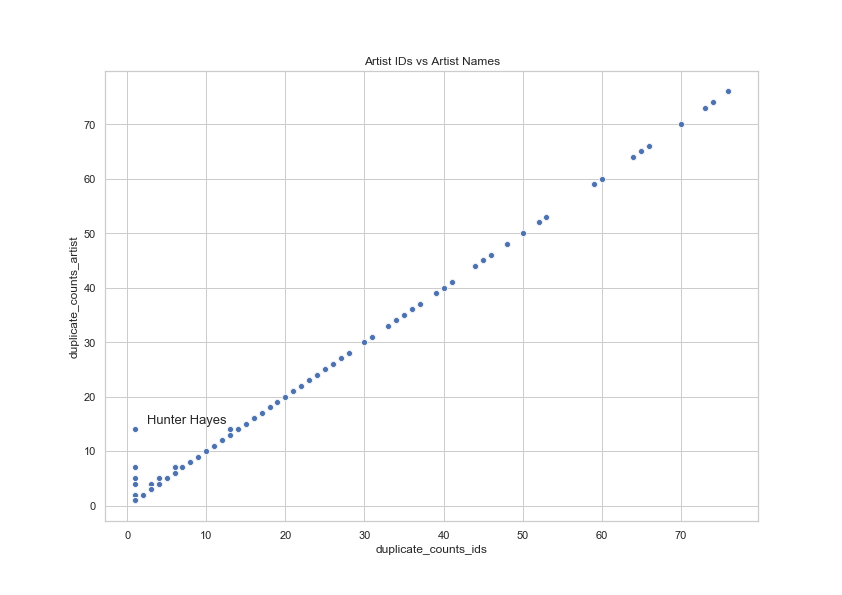
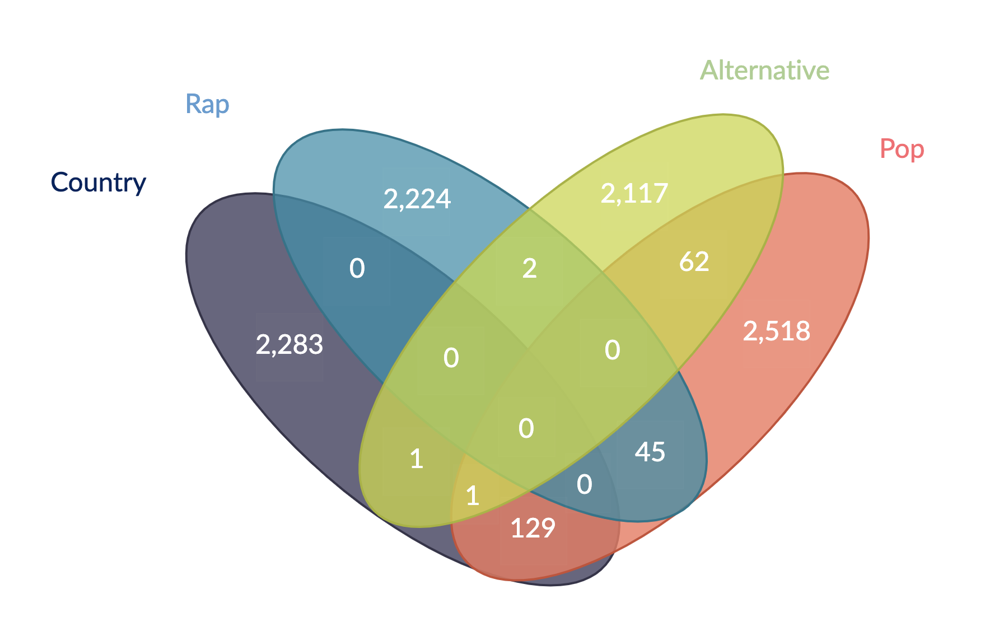
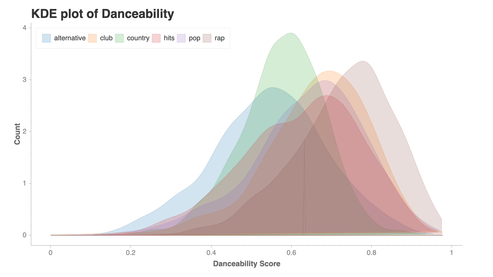
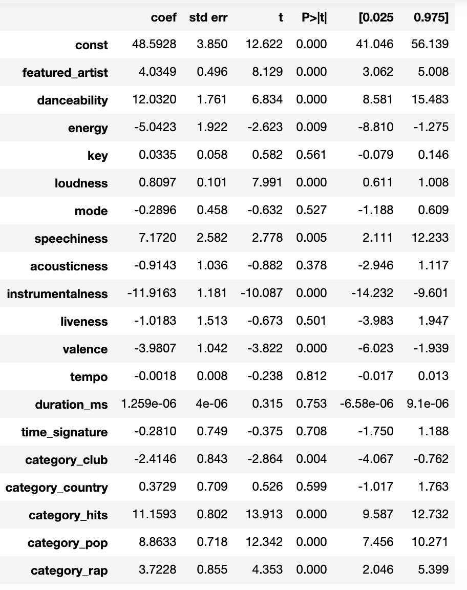

# Song Popularity on Spotify

#### This is my final report on my Capstone for my 3 month data science immersive course.
---
## Table of Contents:
[1.0 Problem Statement](#10-Problem-Statement) 
[2.0 Executive Summary](#20-Executive-Summary) 
[3.0 Constraints](#30-Constraints) 
[4.0 Software APIs Libraries Used](#40-Software_APIs_Libraries_Used) 
[5.0 Data Dictionary](#50-Data-Dictionary) 
[6.0 Exploratory Analysis](#60-Exploratory-Analysis) 
[7.0 Modeling](#70-Modeling) 
[8.0 Conclusions and Next Steps](#80-Conclusions-and-Next-Steps) 
[9.0 Sources and Citations](#90-sources-and-citations) 

---

## 1.0 Problem Statement

#### 1.1 How did we get here? 
My project aims to explore Spotify's song popularity metric. How do we glean insights on song popularity, what types of listeners are listening, and could we manipulate audio features to have an impact on the popularity of a song? We focus on these kinds of questions in the hope to be able to predict song popularity. Why is this important? The motivation follows this train of thought-A certain combination of audio features produces a certain type of popular song --> If a song is popular in multiple genres, you increase the amount of listeners for that song --> More listeners for your song leads to more revenue and exposure for the artist.

## 2.0 Executive Summary

* Having one or more featured artist really contributed to the popularity of a song

* Contrary to prior beliefs, there was no strong linear trend between any audio feature and song popularity, even when filtering by genre was present

* Provided evidence for more intuitive predispositions
 
## 3.0 Constraints
- Could not pull every full playlist
- Only explored four well-defined music genres
- Did not have time to implement a time filter
- Only pulled playlists with 20,000 or more followers

## 4.0 Software APIs Libraries Used

#### 4.1 Data Engineering and Collection
- Python
- Jupyter
- Pandas
- Numpy
- Spotipy
- sklearn
- statsmodels
- tensorflow
- keras
- scipy

#### 4.2 Visuals
- Seaborn
- Matplotlib: Pyplot
- Chartify
- Google Slides
- Bokeh

## 5.0 Data Dictionary
Audio descriptions from Spotify. See resources if you'd like more detail.

| Column | Description |
| --- | --- |
| **track_ids** | A unique object for a song on Spotify |
| **track_pop** | Popularity score of a track from 0-100 calculated by an algorithm based on the total number of plays the track has had and how recent those plays are |
| **track_name** | The name of the track/song on Spotify |
| **artist** | The name of the artist on Spotify |
| **artist_ids** | A unique object for an artist on Spotify |
| **featured_artist** | A binary variable. A value of 1 indicates there is at least one featured artist on the song and 0 entails there are no featured artists |
| **danceability** | How suitable a track is for dancing based on a combination of musical elements including tempo, rhythm stability, beat strength, and overall regularity. A value of 0.0 is least danceable and 1.0 is most danceable. |
| **energy** | Energy is a measure from 0.0 to 1.0 and represents a perceptual measure of intensity and activity. Perceptual features contributing to this attribute include dynamic range, perceived loudness, timbre, onset rate, and general entropy |
| **key** | The key the track is in. Integers map to pitches using standard Pitch Class notation. E.g. 0 = C, 1 = C♯/D♭, 2 = D, and so on. |
| **loudness** | The overall loudness of a track in decibels (dB). Loudness values are averaged across the entire track and are useful for comparing relative loudness of tracks |
| **mode** | The mode of a track. A value of 1 indicates the song is in a major key. A value of 0 entails the song is in a minor key |
| **speechiness** | Speechiness detects the presence of spoken words in a track. Values range from 0-1, as 1 indicating the most 'speechy' |
| **acousticness** | A confidence measure from 0.0 to 1.0 of whether the track is acoustic. 1.0 represents high confidence the track is acoustic |
| **instrumentalness** | Predicts whether a track contains no vocals. The closer the instrumentalness value is to 1.0, the greater likelihood the track contains no vocal content. Values above 0.5 are intended to represent instrumental tracks, but confidence is higher as the value approaches 1.0 |
| **liveness** | Detects the presence of an audience in the recording. Values from 0-1, higher liveness values represent an increased probability that the track was performed live |
| **valence** | A measure from 0.0 to 1.0 describing the musical positiveness conveyed by a track. High valence corresponds to sounding more positive while tracks with low valence sound more negative |
| **tempo** | The overall estimated tempo of a track in beats per minute (BPM). |
| **duration_ms** | The duration of the song in milliseconds |
| **time_signature** | Time signature of a track (how many beats are in each measure) |
| **artist_pop** | A value between 0-100 corresponding to the popularity of the artist. The artist’s popularity is calculated from the popularity of all the artist’s tracks |
| **genre** | The first genre that the artist is associated with on Spotify |
| **category** | The 'genre' that was used in the search API to retrieve the playlist ID's containing all of the songs used. Our six categories are country, alternative, pop, rap, club, and hits |

## 6.0 Exploratory Analysis

### 6.1 Duplicates

Shows the distribution of the categories in our original dataset that included duplicates.

#### Track Duplicates

Shows that most songs have ID and name match as expected. However, we see that some songs have multiple track ID's for the same song. The different track ID's have distinct audio features. In cases like this, the dataset seems to always have more of the same track name than ID. This tells us that when there's a discrepancy between track ID and track name, it's always going to be the case that multiple ID's map to the same song.

#### Artist Duplicates

Similar to track duplicates, most artists and their ID's are unique. However, in the cases that they don't perfectly match, again there is always more ID's mapping to the same artist name.

#### Duplicate Overlap between Genres

Showing how many tracks are in each genre and the overlap where some tracks were found in multiple genres(categories). There is only one track found in three distinct genres-- "10,000 Hours by Dan and Shay ft. Justin Beiber'.

### 6.2 Analysis without Duplicates
The rest of the exploratory data analysis is performed on the dataset that does not contain any duplicates. If a duplicate was found, the dataset takes the first observation where it occurs.

#### Track Popularity

#### Example of KDE plot of an audio feature categorized by genre

More of these plots found in the code/presentation in this repository.

#### Example of some audio feature vs. track popularity scatterplots 

This plot is an example of the audio features not showing any strong trend, whether linear or not.

## 7.0 Modeling
 
#### Models run 
- Linear
- Logistic
- K Nearest Neighbors
- Ridge Regression
- Lasso Regression
- Bagged Decision Trees
- Random Forest
- Neural Networks

### 7.1 Best Interpretable Models
The following models performed the best using the test set's R squared and root mean squared metrics to evaluate.

- Linear Regression: R squared- 0.14, RMSE- 19.88
- Lasso Regression: R squared- 0.13, RMSE- 19.94
- Ridge Regression: R squared- 0.13, RMSE- 19.94

This image shows the beta coefficients from our linear model. Interpreting beta 1, we see that a one unit increase in featured artist leads to about a 4 point increase in track popularity score.

### 7.2 Best Predictive Model
As believed, neural networks performed the best. The fully connected feed forward neural network with L2 regularization and dropout layers had an R squared score of 0.81 and an RMSE score of 9.37. This neural network had two hidden layers and a dropout value of 10%. More details can be found in the code. 

## 8.0 Conclusions and Next Steps 
* We did not have high predictive power for interpretable models
* Featured artists seem to have a real impact on popularity score of a song

- Include not-so-popular songs
- Is track popularity proportional to the number of featured artists on a song?
- Perform more in depth fine tuning of various parameters
- Create a recommender system

## 9.0 Sources and Citations
1. <a href="https://slidesgo.com/theme/music-app-pitch-deck/"> The slide deck template for my presentation</a> 

2. <a href="https://developer.spotify.com/documentation/web-api/reference/tracks/get-several-audio-features/"> The description of all of the audio features of a track</a> 

3. <a href="https://spotipy.readthedocs.io/en/latest/#installation">Documentation about using spotipy</a> 

4. <a href="https://github.com/spotify/chartify">Spotify's own visualization library</a> 