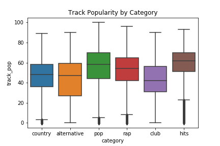

# Song Popularity on Spotify

## Directory Structure

```
.
├── Code
├── Data
├── Images_Plots
├── Final_Report.md
├── Notes.txt
├── README.md
└── Spotify_Capstone.pdf
```


## Project Outline

Spotify is a music streaming service that millions of people use every day. Many people can listen to old music, make their own playlists, discover new songs, embrace their daily mixes, and so much more with this service. This project seeks to glean insights on Spotify's song popularity metric. We look at differences between 4 well-defined music genres(pop, country, alternative, and rap) and two genre derivatives (club and hits) to see if we can predict the song popularity based off Spotify's audio features and some feature engineering. The motivation behind this project is if we could find a linear relationship and interpretable beta coefficients that corresponded to making a popular song, then it could become very marketable within and between genres. A good part of this project also looks at songs that are used in more than one genre. The idea behind looking at songs that are used in multiple genres is if the song is used in more genres, that leads to more listeners, which leads to more money. This could be used for artists, labels, and the overall music industry. 


In this repository I have completed extensive exploratory analysis for the aforementioned genres and tried out many kinds of statistical models. I used white and black box types of models including some fully connected neural networks. To compare these models, I evaluated them with R squared and root mean squared error scores. Out of all of the models I ran, my presentation in this repository shows just the best scoring interpretable models and neural networks.

## Directory Outline
For more details on the files within the directories, there is a `README.md` file within each main subdirectory.

* *[Code](Code)*

> In this directory you will find three more subdirectories titled 'Exploratory Analysis', 'Getting the Data', and 'Modeling'. The first one, 'Exploratory Analysis' provides all the pre-processing code. A more detailed description can be found in the 'Code' README.md. 'Getting the Data' contains multiple notebooks and code on how my final dataframe was made and how I accessed Spotify's API. Again, more details are found in the README.md.  In the last main subdirectory, 'Modeling', you'll find all of the models that I ran to try and predict song popularity. 

* *[Data](Data)*

> The .csv files outputted through the process of this project's timeline. Used the 'final_without_duplicates.csv' file for modeling.

* *[Images_Plots](Images_Plots)*

> A directory that holds the images and plots used in the presentation and the final report. 

* *Final Report*

> This is the final report that has descriptions of the data features, shows some exploratory analysis, and presents our best models.

* *Notes.txt*

> The progression of my personal notes while completing this project. They pertain to challenges, newfound knowledge, and general thoughts.

* *README.md*

> You're looking at it.
